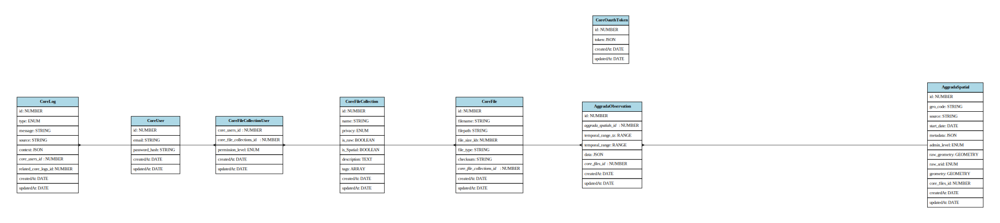

# Database Documentation

## Overview

The database's structure was designed for research centers to manage datasets and associated files. It aims to ensure:

- **Data Governance**: Ownership and access control are enforced at the File Collection level. The `CoreFileCollection` entity includes a `privacy` attribute, which specifies whether the associated files are public or private. For private collections, the `CoreFileCollectionUser` entity manages data access, ensuring that only designated users have proper permissions to handle the data securely.

- **Scalability**: The database supports large files, efficient queries through indexing, and is designed to scale with increasing data volume.

- **Security**: Access control via the `CoreFileCollectionUser` table ensures users have appropriate permissions to datasets, preventing unauthorized access.

## Definitions and Concepts

- **Critical Tables**: The prefix `Core` is used for tables (e.g., `CoreUser`) to designate those that are essential to the system’s functionality. Any modification or deletion of these tables requires extreme caution, as such actions could lead to system failure or significant disruptions.

- **File Collection vs. File**: The concept of a File Collection is retained as a representation of a dataset comprising one or more related files. This structure is particularly beneficial for managing geospatial data (e.g., polygons and points stored in separate files) or time-series data distributed across multiple regions or time periods. A File Collection facilitates efficient versioning, metadata management, and supports operations that span across multiple files, enabling greater flexibility and scalability in data handling.

## Structure

The detailed structure of the entities can be found in the [models directory](./src/models/index.ts).

- **ERD**

- **Normalization**

  - **1NF**: All attributes contain atomic values.

  - **2NF**: No partial dependencies on composite keys.

  - **3NF**: No transitive dependencies.

- **Log registry**

  - See [log table documentation](./LOG.md)
